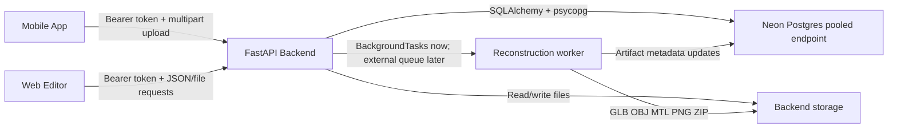
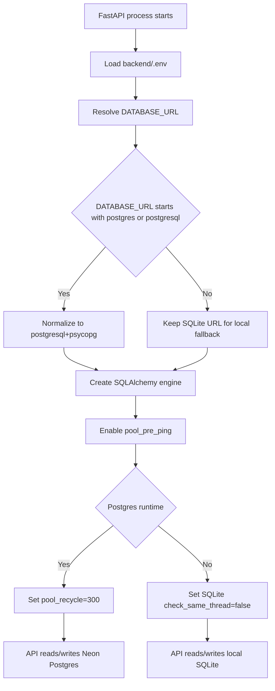
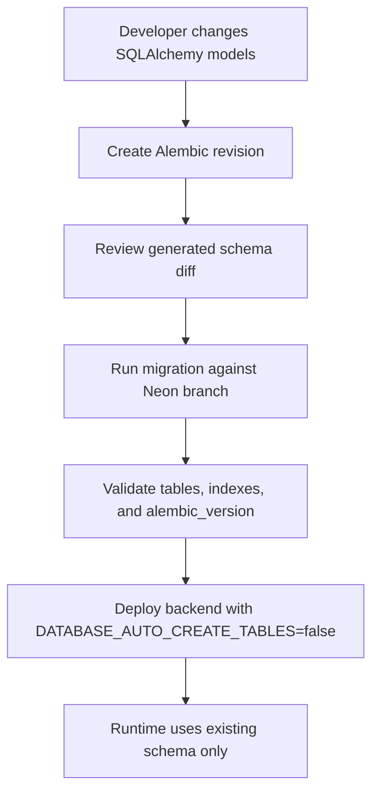
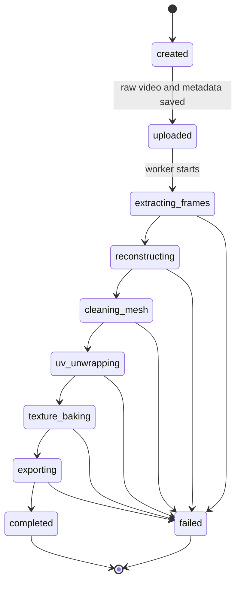
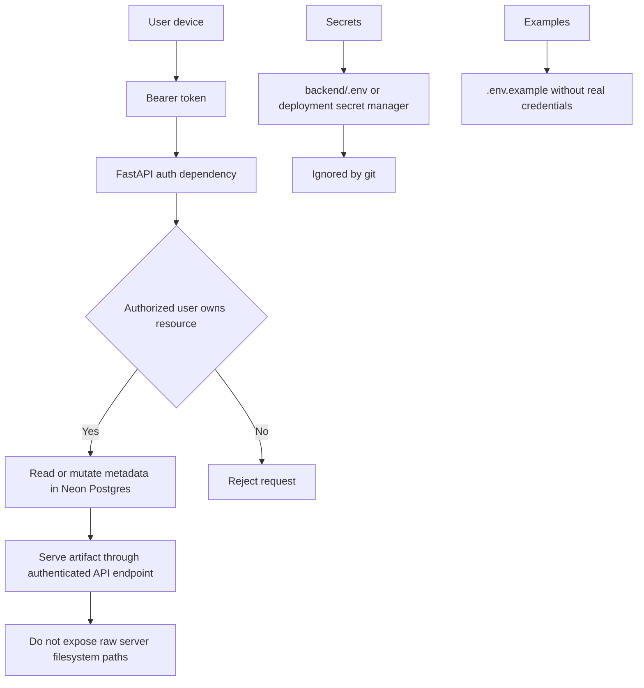
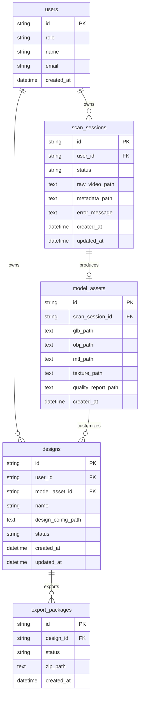
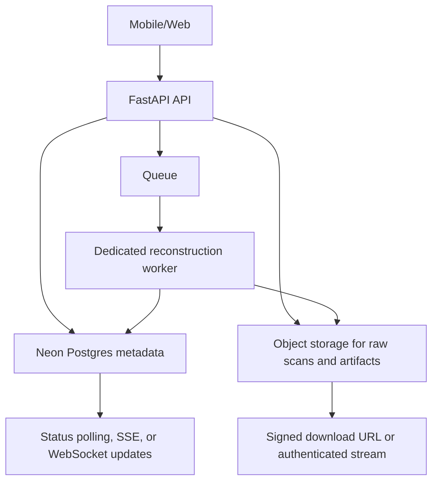

# Current Neon System Flow

Mermaid diagrams in this document target Mermaid `v11.14.0`.

## Context

Repository hien tai da chuyen backend tu SQLite-only sang SQLAlchemy co Neon Postgres cloud database. Backend van dung local storage cho raw scan, generated model, design config va export ZIP. Neon Postgres chi luu metadata, ownership, status va duong dan artifact.

## End-to-end Product Flow

```mermaid
flowchart TD
    A["Flutter Mobile Scanner"] --> B["Record guided shoe video"]
    B --> C["Collect shoe metadata"]
    C --> D["POST /api/auth/demo-login"]
    D --> E["POST /api/scan-sessions"]
    E --> F["Insert scan session into Neon Postgres"]
    F --> G["POST /api/scan-sessions/{id}/upload-video"]
    G --> H["Store raw MP4 and metadata JSON in backend storage"]
    H --> I["Update scan status in Neon Postgres"]
    I --> J["Background reconstruction worker"]
    J --> K["Extract frames"]
    K --> L["Generate or process GLB, OBJ, MTL, texture"]
    L --> M["Insert model asset metadata into Neon Postgres"]
    M --> N["Vite React Web Editor"]
    N --> O["GET scan session and model metadata"]
    O --> P["Download authenticated GLB or OBJ asset"]
    P --> Q["Edit color, material, sticker, text"]
    Q --> R["POST or PUT /api/designs"]
    R --> S["Store design config JSON in backend storage"]
    S --> T["Insert design metadata into Neon Postgres"]
    T --> U["POST /api/designs/{id}/export"]
    U --> V["Create export package ZIP"]
    V --> W["Insert export package metadata into Neon Postgres"]
    W --> X["GET /api/exports/{id}/download"]
```

## Runtime Architecture

## Database Runtime Flow

## Migration Flow

## Scan Status Flow

## Security Boundary

## Current Data Ownership

## Trade-off After Neon Migration

| Decision | Scalable | Maintainable | Security | Performance | User experience |
|---|---|---|---|---|---|
| Neon Postgres for metadata | Supports multi-instance API and concurrent users better than SQLite | Keeps SQLAlchemy model layer stable | Requires strict secret handling and branch protection | Good for status/design/export queries | Reliable cross-device state |
| Local storage for 3D artifacts | Limited when multiple API instances are deployed | Simple for MVP, but will need storage adapter | Files must never be exposed by raw path | Fast on one server, weak for distributed serving | Good enough for demo, weaker for large downloads |
| Alembic for schema | Enables staged schema evolution | Clear revision history | Reduces accidental runtime schema drift | Migration cost is controlled and explicit | Fewer deployment surprises |
| Pooled Neon connection for API | Handles high connection churn | One connection string for runtime | Secrets stay server-side | Good for normal request/response traffic | More stable under concurrent web/mobile use |

## Next Production Flow Target

