# Implementation Flows

Mermaid diagrams in this document target Mermaid `v11.14.0`.

## Current Phase 0 Repository Flow

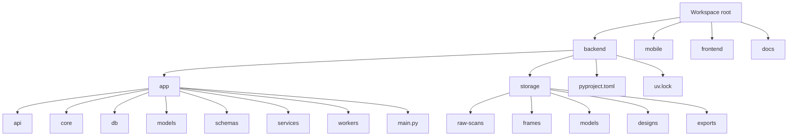

## Current Backend Startup Flow

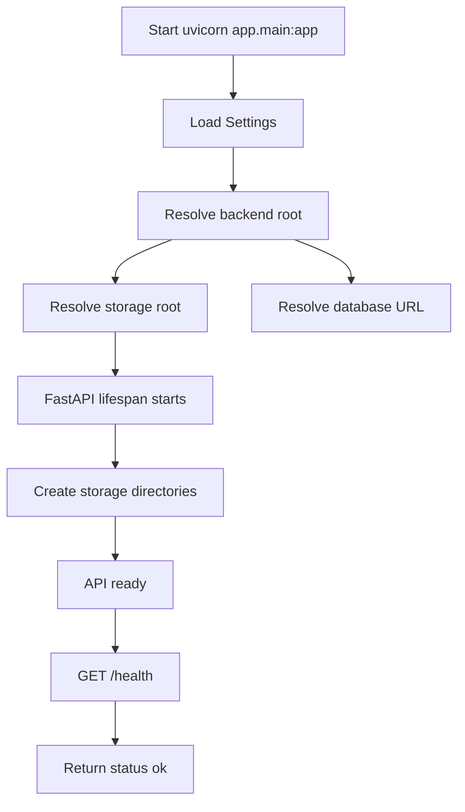

## Current Local Development Flow

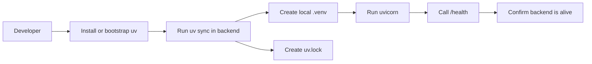

## Current Health Request Sequence

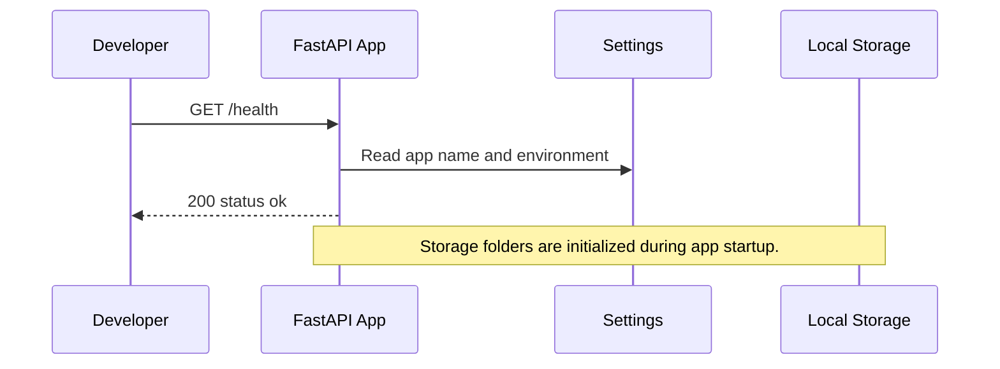

## Target MVP Product Flow

This is the full project flow the repository is being prepared for. Only Phase 0 is implemented now.

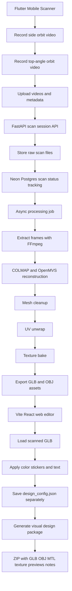

## Implemented Backend MVP Flow

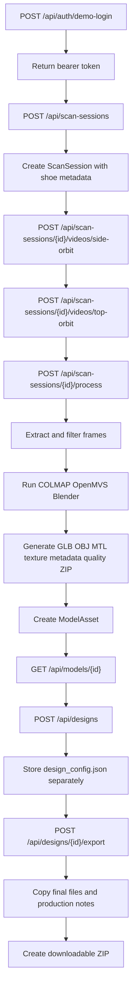

## Implemented Scan Status Flow

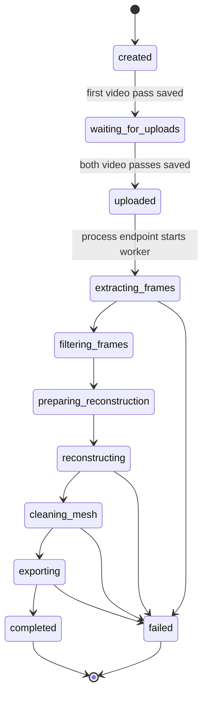

## Implemented Export Package Flow

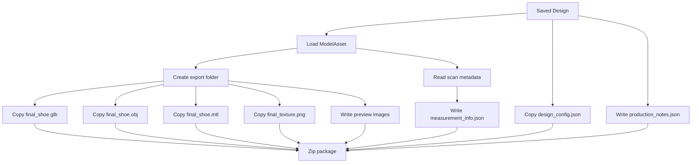

## Implemented Frontend Editor Flow

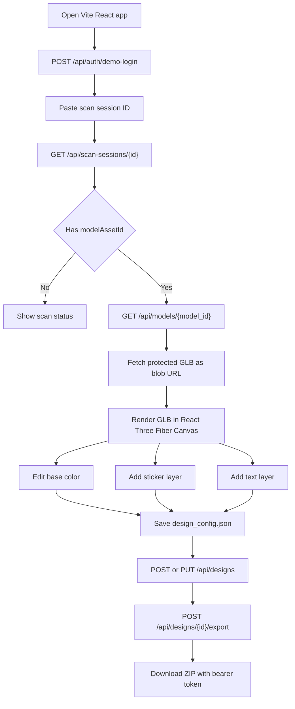

## Implemented Flutter Scanner Source Flow

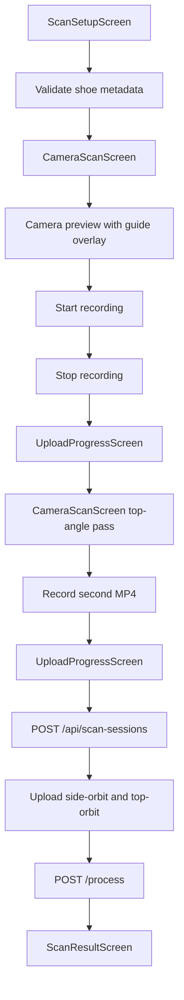

## Planned Auth And Demo Login Flow

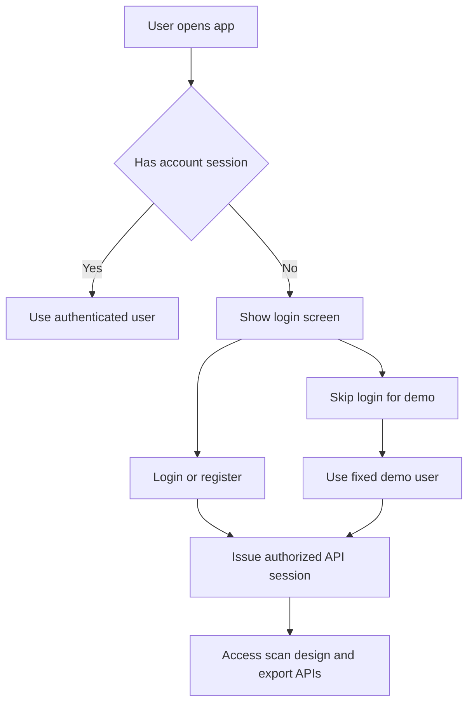

## Phased Implementation Roadmap

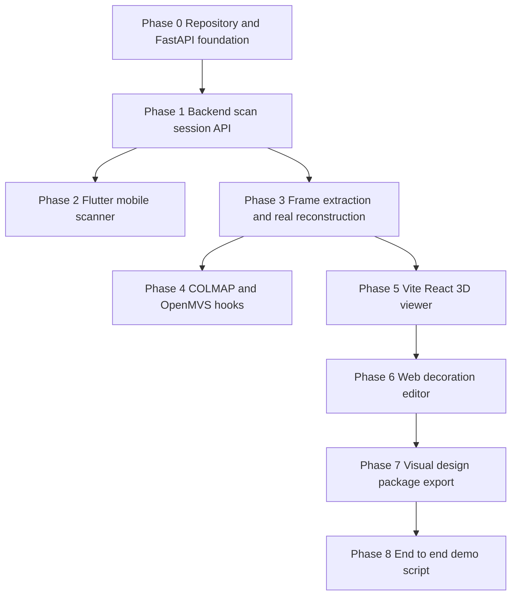
