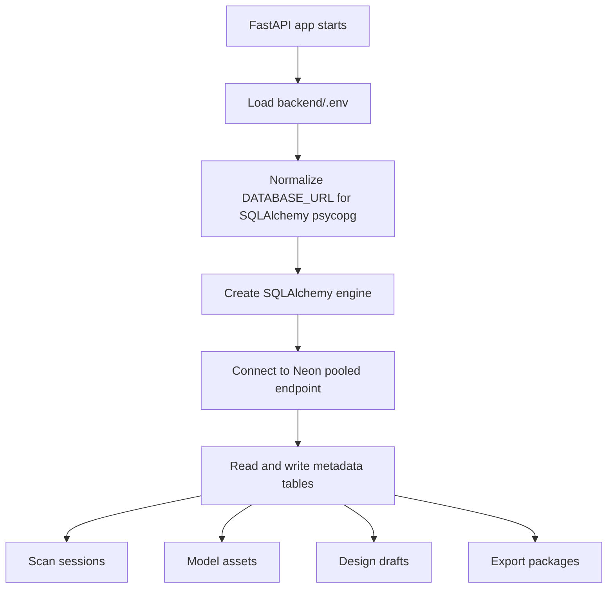
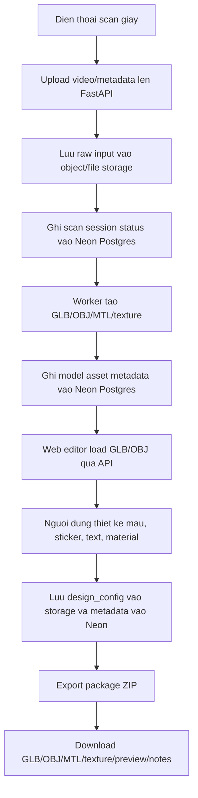

# Neon Postgres Rollout Plan

## Ket luan trien khai hien tai

Backend da duoc chuyen tu SQLite-only sang SQLAlchemy co the ket noi Neon Postgres. Neon project rieng cho san pham da duoc tao va schema ban dau da duoc apply len database cloud.

```text
Project ID: billowing-wildflower-81765826
Branch ID: br-still-grass-aky91j80
Database: neondb
Schema version: 20260517_0001
```

Connection string that contains the database password must stay in `backend/.env` or the deployment platform secret manager.

## Luong trien khai Neon Postgres



## Luong san pham muc tieu



## Trade-off kien truc

| Phuong an | Scalable | Maintainable | Security | Performance | User experience |
|---|---|---|---|---|---|
| Giu SQLite | Kem khi co nhieu user, kho chay multi-instance | Don gian local nhung kho migrate khi product lon | File DB local de mat/ghi de neu deploy sai | Tot cho demo nho, nghen khi concurrent write | De demo, khong phu hop web public |
| Neon Postgres + local file storage | DB scale tot hon, API co the chay multi-instance neu share duoc storage | It thay doi code, hop voi SQLAlchemy hien tai | Secrets can quan ly ky, file local van la diem yeu | Query tot hon SQLite; file van bi gioi han theo server | Tot cho MVP noi bo, chua tot cho production multi-server |
| Neon Postgres + object storage + async worker | Tot nhat cho scan/export lon va nhieu user | Can them queue, storage adapter, lifecycle cleanup | Tach DB secret, signed URL, policy theo user | DB nhe vi chi luu metadata; file lon di qua object storage/CDN | On dinh hon, upload/download/export co progress ro rang |

## Roadmap trien khai san pham

### Phase 1: Database foundation

- Dung Neon Postgres cho users, scan sessions, model assets, designs, export packages.
- Dung Alembic lam nguon su that schema.
- API runtime dung pooled Neon endpoint.
- Migration/admin task dung direct Neon endpoint khi can.
- Tat `DATABASE_AUTO_CREATE_TABLES` tren moi truong deploy.

### Phase 2: File storage foundation

- Tach storage thanh interface: local adapter cho dev, S3/R2 adapter cho staging/prod.
- OBJ/GLB/MTL/PNG/ZIP khong luu truc tiep trong Postgres.
- Luu metadata, owner, checksum, size, mime type, storage key trong Neon.
- Dung signed URL hoac authenticated streaming endpoint.

### Phase 3: Scan and reconstruction pipeline

- Mobile upload raw video/metadata.
- Backend tao scan session va enqueue job.
- Worker xu ly frame extraction, reconstruction, mesh cleanup, UV unwrap, texture bake.
- Neon chi track status, error, artifact reference.
- API tra status de mobile/web poll hoac sau nay dung websocket/SSE.

### Phase 4: Web design editor

- Web load model tu authenticated API.
- Design actions luu vao `design_config.json` va row `designs`.
- Them versioning cho design neu can undo/history.
- Validation server-side cho sticker/text/material config.

### Phase 5: Export pipeline

- Export nen la background job neu file lon.
- Tao ZIP gom model, texture, preview, measurement info, production notes.
- Luu export status vao Neon va file ZIP vao object storage.
- Web hien progress va link download khi complete.

### Phase 6: Production hardening

- Thay demo bearer token bang auth that.
- Ap dung row ownership checks tren moi endpoint.
- Protect production branch, cau hinh backup/restore, monitoring query.
- Test cold start/reconnect cua Neon va retry logic cua API.
- Chon region database gan app server. Project hien tai duoc Neon MCP tao voi default region; truoc production nen xac nhan lai region gan deployment target.

## Cau hoi can chot truoc phase tiep theo

- App production se deploy o dau: Render, Railway, VPS, Vercel, hay platform khac?
- File 3D production muon luu o dau: local disk, S3, Cloudflare R2, hay Supabase Storage?
- Web design can export format nao la bat buoc: OBJ only, GLB, USDZ, FBX, hay ZIP nhu MVP hien tai?
- Auth target la demo token, Neon Auth, Clerk/Auth0, hay custom account system?

## Neon docs tham chieu

- [SQLAlchemy with Neon](https://neon.com/docs/guides/sqlalchemy)
- [Choosing your connection method](https://neon.com/docs/connect/choose-connection)
- [Connection pooling](https://neon.com/docs/connect/connection-pooling)
- [Production checklist](https://neon.com/docs/get-started/production-checklist)
